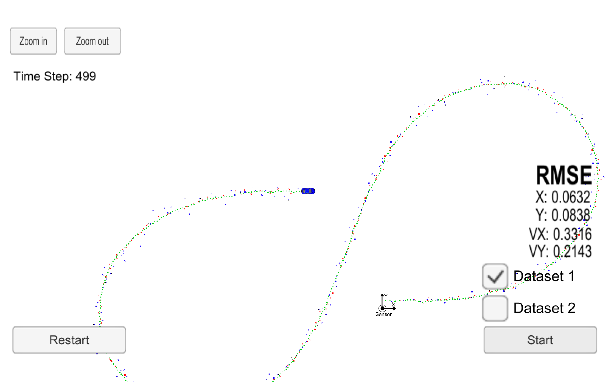
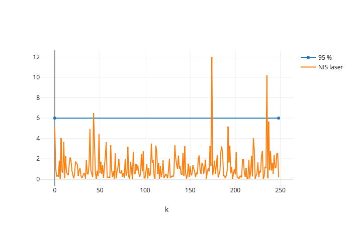
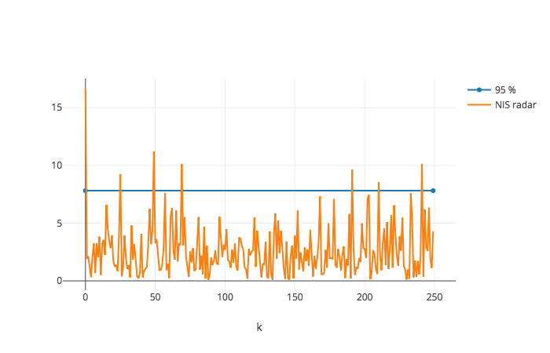
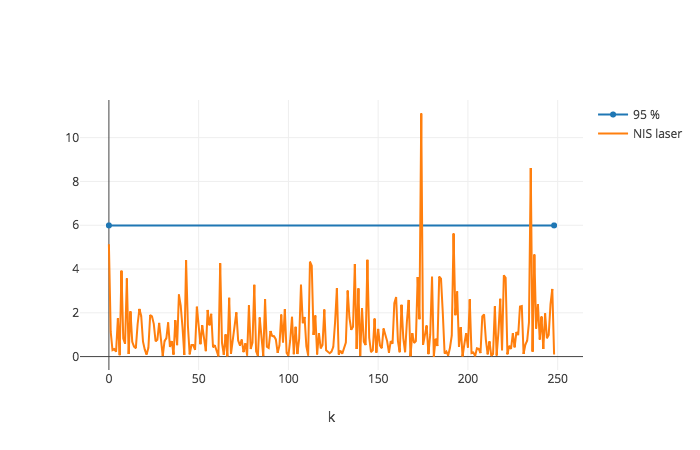
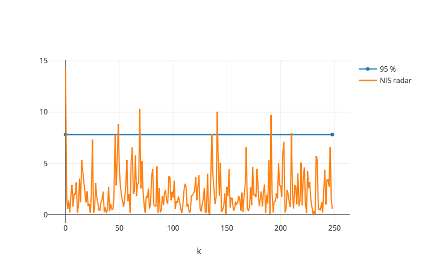

# Uncented Kalman Filter
In this Project the aim was to lower our RMSE (Root Mean Squared Error) to get a better estimation of the location of a bicycle using CTRV motion model via the reading we get from both the Laser and Radar sensors.

## Tuning the Process Noise

Here I tuned the acceleration and the angular noise variables and monitored the RMSE changes. I started with **0.231** as the initial value for the acceleration noise as it is the average acceleration of a bicycle in urban setting, and for the angle **0.7** which is 45 degrees as a starting point. At first I used **9** which is much better than the 30 that was there before, but its still too high for a bicycle. I tried many variations before I ended up with acceleration **0.331** and angle **0.5** which gave the best RMSE.

## RMSE

Upon further examining the RMSE I found out that increasing the acceleration noise while keeping the yaw noise constant increased the RMSE, so every time I increased the acceleration noise I had to decrease the yaw noise which makes sense for the a moving object turns more quickly if it increases its acceleration. I started with the values of **3 m/s^2** for the acceleration noise and **\pi / 4** and kept adjusting both values till I was able to lower the RMSE significantly and the final values were **0.8 m/s^2** for the acceleration noise and **\pi / 4**.

## NIS

Here I evaluated my filter using NIS for both sensors to check its robustness with different process noises as you can see below:

value| Laser | Radar
---|---|---
acc = 0.8, angle = pi/4||
 acc = 0.3, angle = 0.5||
acc, angle = 9||
acc = 9, angle = 0.7||
acc = 0.2331, angle = 0.6||

As we can see both the Laser and the Radar NIS are within the confidence zone, our distribution does not over or under estimate and as a result we get a healthy distribution save for a few values. The best distribution was for the values **0.8 m/s^2** for the acceleration noise and **\pi / 4**.
Laser | Radar
---|---
|

## One Sensor vs Two

### Turned off the Laser
All of the RMSE values increased save for `vy`.

### Turned off the Radar
All of the RSME values increased, but the `vx` value had a big increase of **0.4** vs both sensors.

### Fusion
The sensor fusion RSME gives the best result just as the case of the Extended Kalman Filter.

## UKF vs EKF

After comparing both RMSE I found that the UKF far surpassed its smelly counterpart, and there is no doubt that the unsencted filter is the better filter.

